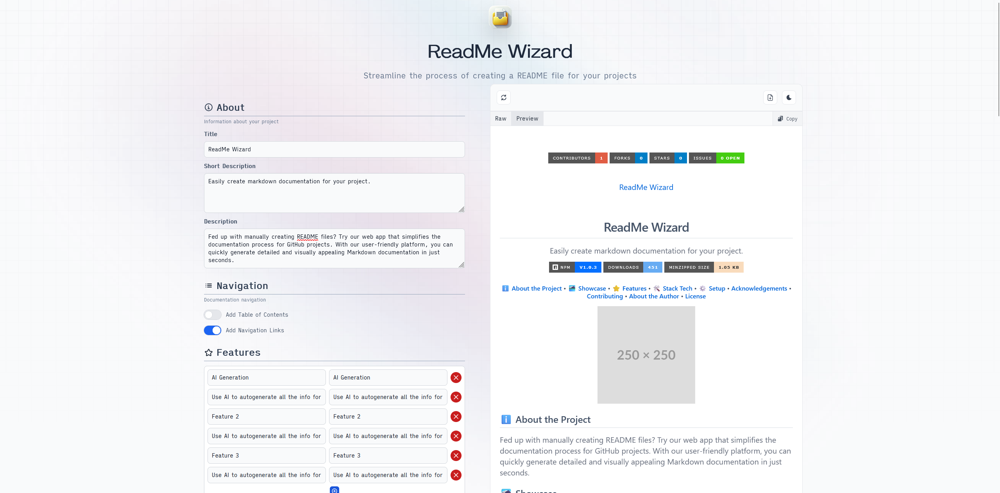

 

# ReadMe Wizard

Easily create markdown documentation for your project

<h4><a href="#table-of-contents">Table of Contents</a> • <a href="#about-the-project">About the Project</a> • <a href="#showcase">Showcase</a> • <a href="#features">Features</a> • <a href="#stack-tech">Stack Tech</a> • <a href="#setup">Setup</a> • <a href="#acknowledgements">Acknowledgements</a> • <a href="#contributing">Contributing</a> • <a href="#about-the-author">About the Author</a> • <a href="#license">License</a></h4>

## Table of Contents

 

Open Contents

- [ReadMe Wizard](#readme-wizard)
    - [About the Project](#about-the-project)
    - [Stack Tech](#stack-tech)
    - [Acknowledgements](#acknowledgements)
    - [Contributing](#contributing)
        - [Ways to Contribute](#ways-to-contribute)
        - [Contribution Instructions](#contribution-instructions)
        - [Contributors](#contributors)
    - [About the Author](#about-the-author)
    - [License](#license)

## About the Project

Tired of manually writing README files? Introducing an web app that streamlines your documentation process for Github
projects. Our intuitive platform lets you generate beautiful and informative Markdown documentation in seconds.

## Stack Tech

- [![Angular][Angular-badge]][Angular-url] - A front-end web application framework

[Angular-badge]: https://img.shields.io/badge/Angular-DD0031?style=for-the-badge&logo=angular

[Angular-url]: https://www.typescriptlang.org/}

## Acknowledgements

- [ngx-markdown](https://www.npmjs.com/package/ngx-markdown) - Angular markdown component/directive/pipe/service to
  parse static, dynamic or remote content to HTML with syntax highlight and more
- [Flowbite](https://flowbite.com/) - Build websites even faster with components on top of Tailwind CSS
- [PrismJs](https://prismjs.com/) - Prism is a lightweight, extensible syntax highlighter, built with modern web
  standards in mind. It’s used in millions of websites, including some of those you visit daily.

## Contributing

We welcome contributions from the community! If you would like to contribute to this project, please follow the
guidelines below.

### Ways to Contribute

- Report bugs or issues by opening a new issue on our GitHub repository.
- Suggest new features or improvements by opening a new issue on our GitHub repository.
- Contribute code by forking the repository, making changes, and submitting a pull request.

### Contribution Instructions

1. Fork the repository.
2. Create a new branch for your feature or bug fix: `git checkout -b my-feature-branch`.
3. Make the necessary changes and commit them: `git commit -am 'Add my new feature'`.
4. Push your branch to your forked repository: `git push origin my-feature-branch`.
5. Open a pull request against the main repository, describing the changes you made and why they should be merged.

### Contributors

- Hazel Granados (hazeliscoding)

## About the Author

**Hazel Granados**

This project was created by Hazel Granados. Connect with me on [GitHub](https://github.com/https://github.com/hazeliscoding)
and [LinkedIn](https://www.linkedin.com/in/https://www.linkedin.com/in/hazelgranados/) to learn more about my projects and
professional background.

## License

This project is licensed under the [MIT License](https://opensource.org/licenses/MIT).

---
 
Built with ❤️ with <a href="https://github.com/hazeliscoding/readme-wizard">ReadMe Wizard</a>

